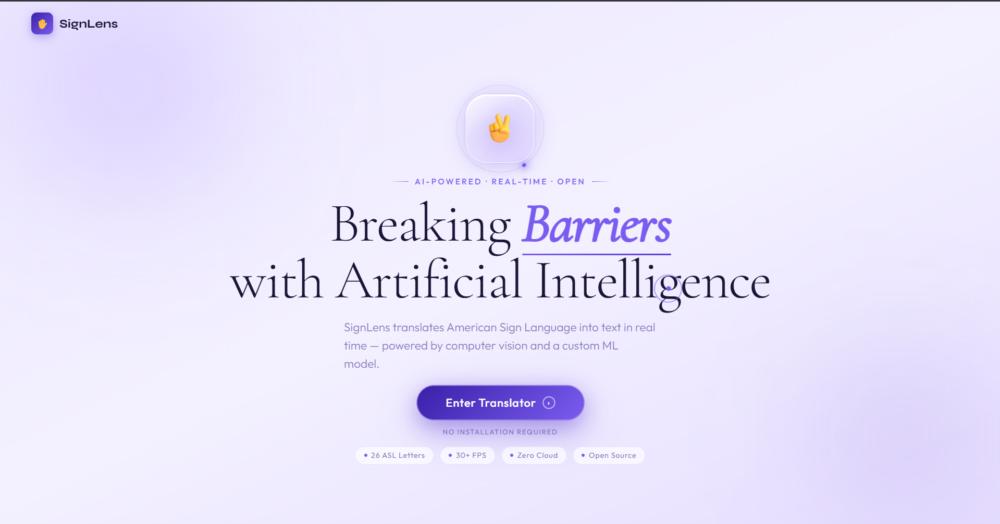
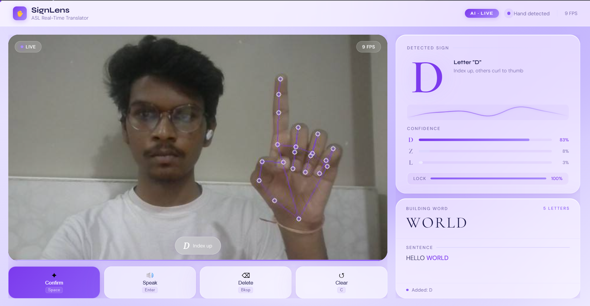
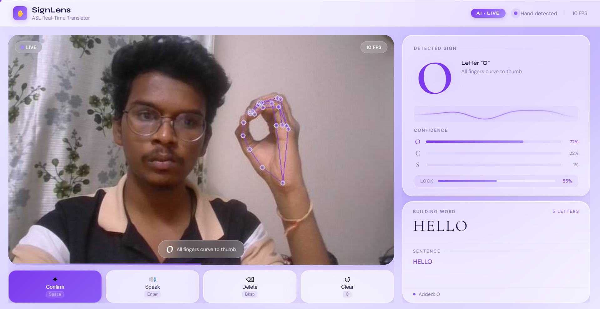

# 🤟 SignLens — Real-Time ASL Recognition System

<div align="center">


**Breaking barriers with AI — translating American Sign Language into text, in real time.**

</div>

---

## 🧠 What is SignLens?

SignLens is a real-time American Sign Language (ASL) gesture recognition system that translates hand gestures into text instantly — powered by computer vision and a custom-trained ML model.

No installation required on the client side. Open the browser, show your hand, and SignLens reads it.

---

## ✨ Features

- 🖐️ **Real-time hand landmark detection** using MediaPipe (21 keypoints per hand)
- 🔤 **Recognizes all 26 ASL alphabet letters** with 98% accuracy
- ⚡ **30+ FPS** live video processing
- 📊 **Per-letter confidence scoring** (top 3 predictions shown live)
- 🔠 **Word & sentence builder** — letters combine into words automatically
- 🔊 **Text-to-speech** — speaks the built sentence on command
- 🌐 **WebSocket communication** between Python backend and browser frontend
- 💜 **Holographic HUD-style UI** — no installation required on client

---

## 🛠️ Tech Stack

| Layer | Technology |
|---|---|
| Language | Python 3.10+ |
| Backend | Flask, WebSocket |
| Computer Vision | MediaPipe |
| ML Model | CNN + Ensemble (scikit-learn) |
| Frontend | HTML, CSS, JavaScript |
| Data | Custom dataset (CSV) |

---

## 📁 Project Structure

```
Ai-Sign-Language-Translator/
│
├── main.py              # Flask server + WebSocket handler
├── predict.py           # Real-time prediction logic
├── train.py             # Model training script (letters)
├── train_words.py       # Model training script (words)
├── features.py          # Hand landmark feature extraction
├── data.py              # Data collection script
├── data_words.py        # Word-level data collection
├── clean.py             # Dataset cleaning utility
├── model.pkl            # Trained letter recognition model
├── word_model.pkl       # Trained word recognition model
├── data.csv             # Letter training dataset
├── data_words.csv       # Word training dataset
├── index.html           # Landing page UI
└── asl_translator.html  # Main translator interface
```

---

## 🚀 Getting Started

### Prerequisites

- Python 3.10+
- Webcam

### Installation

```bash
# Clone the repository
git clone https://github.com/Santhoshk-7/Ai-Sign-Language-Translator.git

# Navigate into the project
cd Ai-Sign-Language-Translator

# Create a virtual environment
python -m venv venv
source venv/bin/activate  # On Windows: venv\Scripts\activate

# Install dependencies
pip install flask mediapipe scikit-learn numpy opencv-python
```

### Run the App

```bash
python main.py
```

Then open your browser and go to:
```
http://localhost:5000
```

---

## 🎯 How It Works

```
Webcam Feed
    ↓
MediaPipe Hand Landmark Detection (21 keypoints)
    ↓
Feature Extraction (angles, distances)
    ↓
CNN / Ensemble ML Model
    ↓
Letter Prediction + Confidence Score
    ↓
Word Builder → Sentence → Text-to-Speech
```

---

## 📊 Model Performance

| Metric | Value |
|---|---|
| Accuracy | 98% |
| Speed | 30+ FPS |
| Letters Supported | 26 (A–Z) |
| Input | Webcam (real-time) |

---

## 🖼️ Screenshots

### Landing Page


### Live Translator — HELLO WORLD


### Word Builder in Action

---

## 🔮 Future Improvements

- [ ] Support for dynamic gestures (J, Z which require motion)
- [ ] Word-level recognition expansion
- [ ] Mobile browser support
- [ ] Multilingual sign language support (ISL, BSL)
- [ ] Export conversation as text file

---

## 👨‍💻 Author

**Santhosh Karre**
CS Student @ ACE Engineering College, Hyderabad

[](https://linkedin.com/in/santhosh-karre)
[](https://github.com/Santhoshk-7)

---

## 📄 License

This project is open source and available under the [MIT License](LICENSE).

---

<div align="center">
Made with 💜 to break communication barriers
</div>
